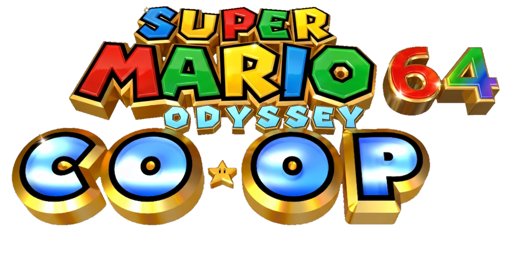

# Super Mario 64 OMM-Coop

**Super Mario 64 OMM-Coop** es un proyecto de multijugador en línea para el PC port de Super Mario 64, basado en **sm64coopdx** (creado por el Coop Deluxe Team, continuando el trabajo de sm64ex-coop de djoslin0) e integrado con las capturas nativas y contenido del **OMM** (Outward-Mario-Moves).

Sincroniza enemigos, eventos y niveles para múltiples jugadores, y añade el modo de captura de OMM, más personalización y un Lua API con más poder para modders y jugadores.

Si encuentras algún bug, no dudes en reportarlo o contribuir al proyecto.

## Objetivo inicial (cumplido)

Crear un mod del PC port en el que varias personas puedan jugar juntas en línea.

A diferencia de proyectos multijugador anteriores, este sincroniza enemigos y eventos, permitiendo que los jugadores interactúen con el mismo mundo al mismo tiempo.

## Documentación

sm64coopdx es modificable mediante Lua, similar a las APIs de Lua de Roblox y Garry's Mod. Para empezar, pulsa [aquí](docs/lua/lua.md) para ver la documentación de Lua. Si quieres contribuir al repositorio, puedes ver la documentación de C [aquí](docs/c/c.md).

## Créditos

Los créditos completos están en [credits.txt](credits.txt).

## Descargas

Las compilaciones de Android se generan automáticamente vía GitHub Actions. Descarga el artefacto `Super_Mario_64_OMM-Coop_Android.zip` del workflow [build-coop](.github/workflows/build-coop.yaml).
